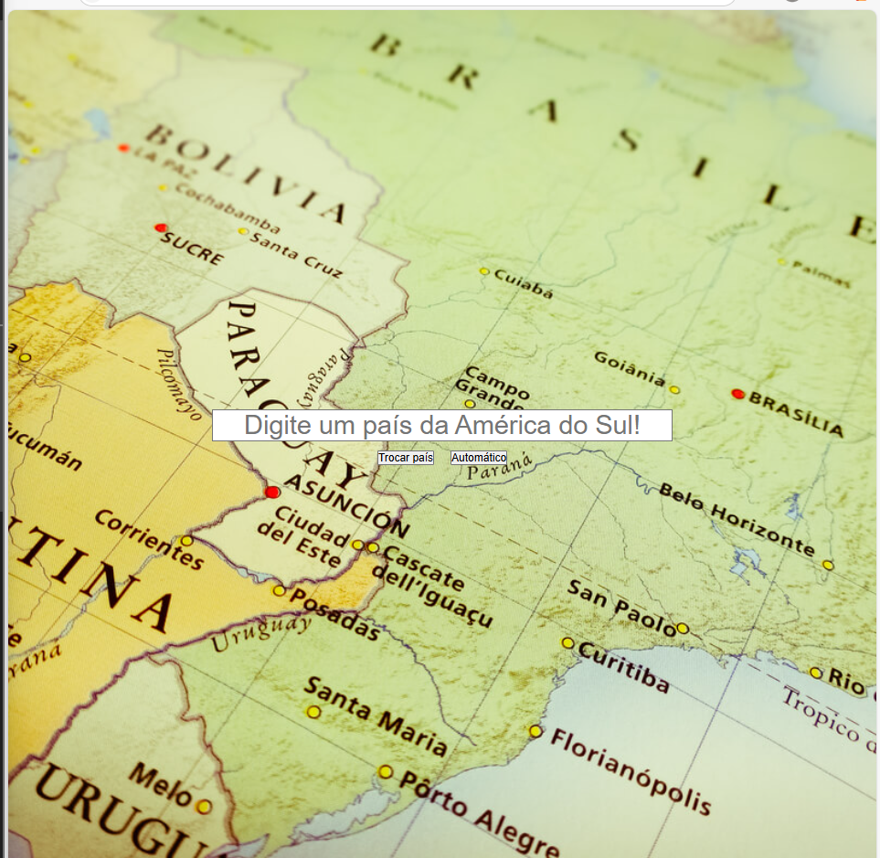

# trocar-img

Este é um site criado com JavaScript, que faz requisições dentro do próprio código. O usuário digita manualmente o nome dos países da América do Sul, e a bandeira correspondente aparece na tela.

## Tecnologias
* HTML
* CSS
* JS

## Autor
[Isabelle](https://www.linkedin.com/in/IsabelleAbreuu)